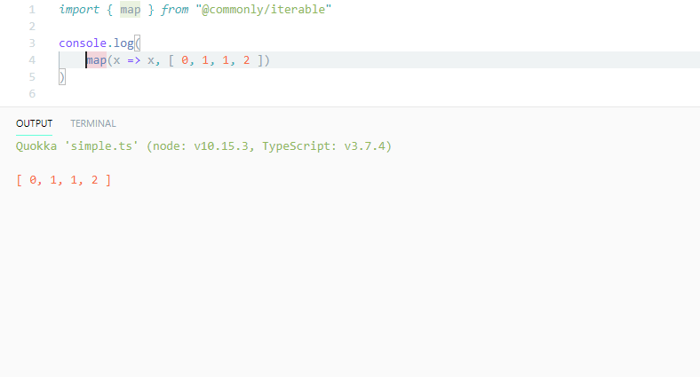
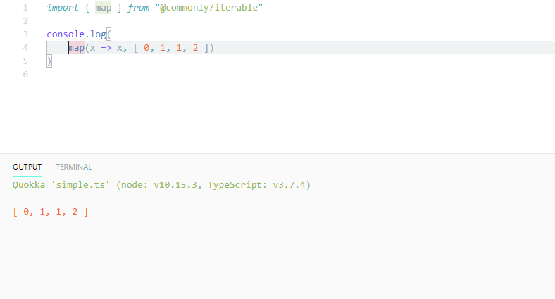
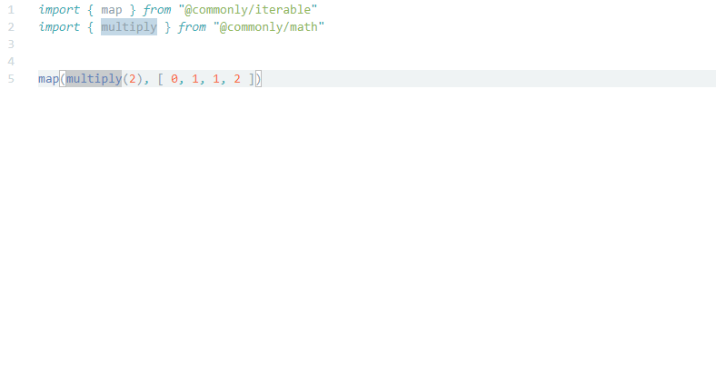

<p align="left">
  <a href="https://github.com/commonlyjs/commonly/actions">
    
  </a>
  <a href="https://coveralls.io/github/commonlyjs/commonly?branch=master">
    
  </a>
  <a href="https://codecov.io/gh/commonlyjs/commonly">
    
  </a>
  <a href="https://david-dm.org/commonlyjs/commonly" title="Dependencies Status">
    
  </a>
  <a href="https://gitter.im/commonlyjs/community?utm_source=badge&utm_medium=badge&utm_campaign=pr-badge">
    
  </a>
</p>

<br />
<br />
<br />
<p align="center">
  
  <p align="center">
    The most comprehensive modern utility library for JavaScript/TypeScript.
    <br />
    <a href="https://commonlyjs.com/api"><strong>Explore the API »</strong></a>
    <br />
    <br />
    <a href="https://github.com/commonlyjs/commonly/issues">Report a bug</a>
    &nbsp;&nbsp;·&nbsp;&nbsp;
    <a href="https://github.com/commonlyjs/commonly/issues">Request a feature</a>
  </p>
</p>
<br />
<br />


Table of Contents
------------------
* [Overview](#overview)
    * [Why Commonly?](#why-commonly)
        * [Key features](#key-features)
    * [Enhance your experience](#enhance-your-experience)
* [Getting started](#getting-started)
    * [Installation](#installation)
    * [Examples](#examples)
* [Documentation](#documentation)
    * [Articles](#articles)
    * [API reference](#api-reference)
    * [Cookbook](#cookbook)
* [Roadmap](#roadmap)


Overview  
--------- 
> Keep in mind that not everything is implemented yet, for now only packages installed with a `@next` tag are useable.  
> See what's done and what's next on the [roadmap](#roadmap).

### Why Commonly?
Commonly is a general-purpose library that expands on the JavaScript API, similar libraries do exist, but none I could be happy with.

What I wanted is to have a solid unopinionated general-purpose library without any hidden unnecessary gimmicks.  
A toolkit library that could be easily extended by its user. Here is [my take on the issue](https://imgs.xkcd.com/comics/standards.png), presenting Commonly.

#### Key features
* Every function is pure, they will never mutate your data.
* Extensible protocol-based architecture, every function is bound to work with your custom data structures.
* Process often overlooked data types with ease, operate on a Map, Set, HTMLCollection, NodeList and more (+24).
* Builtin interoperability with your favorite libraries.
    * Support for Streams/Observables: [RxJS](https://github.com/ReactiveX/rxjs), [Most](https://github.com/cujojs/most), [flyd](https://github.com/paldepind/flyd).
    * Support for immutable data structures: [Immutable.js](https://github.com/immutable-js/immutable-js), [mori](https://github.com/swannodette/mori).


### Enhance your experience
<p align="left">
  <strong>Run-time type system</strong><br/>
  
  You are protected from common mistakes you often make by a dynamic type checking.
  An error with a detailed message will be thrown whenever either an argument is of the wrong type or you tried to apply too many of them.
  <br />
  <br />  
  Evaluation is done eagerly as you provide arguments to a function individually to improve error reporting for partially applied functions.
</p>
<br />
<br />
<br />
<p align="left">
  <strong>Tightly typed</strong><br/>
  
  Discover the API by simply typing.  
  Each library's member is strictly typed, do not let those silly type errors slip by.
  <br />
  <br />
  Every functional utility comes with complete type definitions. <br />
  No more untyped <code>compose</code>, <code>partial</code> and <code>curry</code>.
</p>
<br />
<br />
<br />
<br />
<br />
<p align="left">
  <strong>Inline documentation</strong><br/>
  
  Easily learn about details of a function on the fly.
  We carefully document our code, so you will never have to browse manually through the documentation again.
  <br />
  <br />   
  Whenever you feel lost, see included external resources attached as links or just try out included examples.
</p>
<br />
<br />
<br />


Getting started  
----------------
This library comes in multiple packages, you match and choose whichever you need.  

Some of the packages may have dependencies, often only related to the problem they are solving.  
An example of such is the `@commonly/type` package, from which only TypeScript users can benefit.
Another example is a package that may require a specific environment, like a browser or a Node.js-based one.  

When a package requires such, it should state so in its manifest file, a package.json, and the documentation.

### Installation
As an example, we will install a couple of core packages.
```shell script
npm install   @commonly/function  @commonly/iterable  @commonly/math  @commonly/number  @commonly/string
```
**Users of TypeScript**, remember to install the `@commonly/type` package, it contains type definitions used in other packages.

### Examples
Simplify your code.
```typescript
import { flatten, partition } from "@commonly/iterable"

const quicksort = (xs) => {
    if (xs.length < 2) {
        return xs
    } else {
        const [ pivot, ...remainder ] = xs
        const [ lesser, greater ] = partition(x => x <= pivot, remainder)
        return flatten([ quicksort(lesser), pivot, quicksort(greater) ])
    }
}
```

Easily extend capabilities of the library with merely few lines of code.
```typescript
// No example yet
// To do: An example on how to create some missing functionality (something from a cookbook). 
```

Operate on any common data structure with only a single set of API. 
```typescript
// No example yet
// To do: An example of interoperability with some popular library. 
// Libraries to include:
//     * RxJS
```

Adjust how your data structures interact with those functions.
```typescript
//- Vector.ts
import { Operand } from "@commonly/protocol"

class Vector implements Operand {
    constructor(x, y) {
        this.x = x
        this.y = y
    }

    // Let us use `add` function on instances of the `Vector` type.
    // Note: You can only affect the behaviour of functions which expects a specific contract.
    [Operand.augend](addend) {
        return new Vector(this.x + addend.x, this.y + addend.y)
    }
}


//- Particle.ts
import { Iterable, Reducible } from "@commonly/protocol"
import { map } from "@commonly/iterable"
import { add } from "@commonly/math"

class Arrow extends Vector implements Iterable, Reducible { 
    constructor(x, y) {
        super(x, y)
    }
}

//- Quiver.ts
class Quiver {
    constructor(...arrows) {
        this.arrows = arrows
    }

    draw() {
        return this.arrow.pop()
    }

    [Iterable.iterator]*() {
        for (const arrow of this.arrows) {
            yield arrow
        }
    }

    [Reducible.reducer]() {
        const reducer = (quiver, arrow) => {
         
        }
    
        return reducer
    }
}


//- index.ts
let previousWind = new Vector(Math.random() - Math.random(), Math.random() - Math.random())
const quiver = new Quiver(
    new Arrow(0, 0),
    new Arrow(0, 0)
)

function tick() {
    window.requestAnimationFrame(() => {
        const wind = add(previousWind, new Vector(Math.random(), Math.random()))
        arrows = map(add(wind), arrows)
        previousWind = wind    
        for (const [ x, y ] of arrows) {
            console.log(`A snowflake is at position { x: ${x}, y: ${y} }`)
        }

        tick()
    })
}
```


Documentation  
--------------
We do our best to provide you with the most complete documentation to deliver you a wonderful developer experience.  
To achieve this we code clean with type annotations and inline documentation, 
write human-readable unit tests in a [behavior-driven development](https://en.wikipedia.org/wiki/Behavior-driven_development) fashion and produce helpful content with examples.

### Articles
You can find articles on more advanced usage and some exciting subjects we try to tackle on [commonlyjs.com/articles/](https://commonlyjs.com/articles/).

### API reference
Every member of our API can be found here on [commonlyjs.com/api/](https://commonlyjs.com/api/).  
You can also browse `packages/<package-name>/docs/` directory if you prefer to read in a GitHub markdown format.
Both documents are synchronized, so you will never find any to be out of date.

### Cookbook
Whenever you find some functionality missing, look for it in our cookbook on [commonlyjs.com/cookbook/](https://commonlyjs.com/cookbook/).


Roadmap  
--------
### 1.x-next
* [ ] Automate the package publication process and a generation of the package's documentation.
* [ ] Update every function's JSDoc to include [Damas–Hindley–Milner type](https://en.wikipedia.org/wiki/Hindley%E2%80%93Milner_type_system) signature.
* [ ] Implement a runtime type checking for every included function based on [Algorithm W](https://en.wikipedia.org/wiki/Hindley%E2%80%93Milner_type_system#Algorithm_W).
* [ ] Produce more content:
    * [ ] Cookbook with simple recipes.
    * [ ] Guidelines for contributors.
    * [ ] Couple of articles:
        * [ ] Introduction to the library.
* [ ] Improve stack traces and debugging for functions decorated with `curry`, `compose` and `partial`.
* [ ] Provide complete set of core packages:
    * [ ] `@commonly/data`
        * [ ] `@commonly/data/MultiwayTree`
        * [ ] `@commonly/data/Matrix`
        * [ ] `@commonly/data/Stack`
        * [ ] `@commonly/data/Queue`
        * [ ] `@commonly/data/Vector`
    * [ ] `@commonly/function`
        * [ ] `@commonly/function/compose`
        * [ ] `@commonly/function/curry`
        * [ ] `@commonly/function/debounce`
        * [ ] `@commonly/function/identity`
        * [ ] `@commonly/function/memoize`
        * [ ] `@commonly/function/negate`
        * [ ] `@commonly/function/noop`
        * [ ] `@commonly/function/partial`
        * [ ] `@commonly/function/pipe`
        * [ ] `@commonly/function/reduced`
        * [ ] `@commonly/function/reducer`
        * [ ] `@commonly/function/tap`
        * [ ] `@commonly/function/throttle`
    * [ ] `@commonly/iterable`
        * [ ] `@commonly/iterable/adjust`
        * [ ] `@commonly/iterable/append`
        * [ ] `@commonly/iterable/chain`
        * [ ] `@commonly/iterable/concat`
        * [ ] `@commonly/iterable/drop`
        * [ ] `@commonly/iterable/every`
        * [ ] `@commonly/iterable/filter`
        * [ ] `@commonly/iterable/find`
        * [ ] `@commonly/iterable/flatten`
        * [ ] `@commonly/iterable/head`
        * [ ] `@commonly/iterable/includes`
        * [ ] `@commonly/iterable/insert`
        * [ ] `@commonly/iterable/last`
        * [ ] `@commonly/iterable/map`
        * [ ] `@commonly/iterable/nth`
        * [ ] `@commonly/iterable/prepend`
        * [ ] `@commonly/iterable/reduce`
        * [ ] `@commonly/iterable/reverse`
        * [ ] `@commonly/iterable/slice`
        * [ ] `@commonly/iterable/some`
        * [ ] `@commonly/iterable/sort`
        * [ ] `@commonly/iterable/tail`
        * [ ] `@commonly/iterable/take`
        * [ ] `@commonly/iterable/transduce`
        * [ ] `@commonly/iterable/unzip`
        * [ ] `@commonly/iterable/zip`
    * [ ] `@commonly/logic`
        * [ ] `@commonly/logic/and`
        * [ ] `@commonly/logic/nand`
        * [ ] `@commonly/logic/not`
        * [ ] `@commonly/logic/or`
        * [ ] `@commonly/logic/xnor`
        * [ ] `@commonly/logic/xor`
    * [ ] `@commonly/math`
        * [ ] `@commonly/math/add`
        * [ ] `@commonly/math/ceil`
        * [ ] `@commonly/math/decrement`
        * [ ] `@commonly/math/divide`
        * [ ] `@commonly/math/floor`
        * [ ] `@commonly/math/increment`
        * [ ] `@commonly/math/maximum`
        * [ ] `@commonly/math/mean`
        * [ ] `@commonly/math/median`
        * [ ] `@commonly/math/minimum`
        * [ ] `@commonly/math/modulo`
        * [ ] `@commonly/math/multiply`
        * [ ] `@commonly/math/round`
        * [ ] `@commonly/math/subtract`
    * [ ] `@commonly/number`
        * [ ] `@commonly/number/clamp`
        * [ ] `@commonly/number/random`
    * [ ] `@commonly/reflect`
        * [ ] `@commonly/reflect/isArray`
        * [ ] `@commonly/reflect/isBoolean`
        * [ ] `@commonly/reflect/isError`
        * [ ] `@commonly/reflect/isFunction`
        * [ ] `@commonly/reflect/isMap`
        * [ ] `@commonly/reflect/isNil`
        * [ ] `@commonly/reflect/isNull`
        * [ ] `@commonly/reflect/isNumber`
        * [ ] `@commonly/reflect/isObject`
        * [ ] `@commonly/reflect/isPrimitve`
        * [ ] `@commonly/reflect/isPromise`
        * [ ] `@commonly/reflect/isReduced`
        * [ ] `@commonly/reflect/isRegExp`
        * [ ] `@commonly/reflect/isSet`
        * [ ] `@commonly/reflect/isString`
        * [ ] `@commonly/reflect/isSymbol`
        * [ ] `@commonly/reflect/isUndefined`
    * [ ] `@commonly/string`
        * [ ] `@commonly/string/camelcase`
        * [ ] `@commonly/string/capitalize`
        * [ ] `@commonly/string/constantcase`
        * [ ] `@commonly/string/dashcase`
        * [ ] `@commonly/string/lowercase`
        * [ ] `@commonly/string/pascalcase`
        * [ ] `@commonly/string/snakecase`
        * [ ] `@commonly/string/traincase`
        * [ ] `@commonly/string/trim`
        * [ ] `@commonly/string/uppercase`
        * [ ] `@commonly/string/words`
    * [ ] `@commonly/transducer`
        * [ ] `@commonly/transducer/xchain`
        * [ ] `@commonly/transducer/xdrop`
        * [ ] `@commonly/transducer/xfilter`
        * [ ] `@commonly/transducer/xflatten`
        * [ ] `@commonly/transducer/xmap`
        * [ ] `@commonly/transducer/xslice`
        * [ ] `@commonly/transducer/xtail`
        * [ ] `@commonly/transducer/xtake`
    * [ ] `@commonly/type`
        * [ ] `@commonly/type/Identity`
        * [ ] `@commonly/type/Mapper`
        * [ ] `@commonly/type/Predicate`
        * [ ] `@commonly/type/Primitive`
        * [ ] `@commonly/type/Reduced`
        * [ ] `@commonly/type/Reducer`
        * [ ] `@commonly/type/Transducer`
* [ ] Provide complete set of auxiliary packages:
    * [ ] `@commonly/async`
    * [ ] `@commonly/dom`
    * [ ] `@commonly/fs`
* [ ] Enable interoperability with data structures from popular JavaScript libraries:
    * [ ] Immutable: [Immutable.js](https://github.com/immutable-js/immutable-js)
    * [ ] Immutable: [mori](https://github.com/swannodette/mori)
    * [ ] Stream/Observable: [RxJS](https://github.com/ReactiveX/rxjs)
    * [ ] Stream/Observable: [Most](https://github.com/cujojs/most)
    * [ ] Stream/Observable: [flyd](https://github.com/paldepind/flyd)


---
##### My notes:
> * ~~Often missing/broken type definitions.~~
> * ~~Awful debugging experience/bloated stacktraces.~~
> * ~~Would implicitly mutate my data.~~
> * Ambiguous API / heavy use of function overloading/ implicitly casts data structures for no good reason.
> * Discriminate other data structures than simple arrays/objects.
> * Either it could not be tree shaken properly or was not modular at all.
> * Eagerly evaluated meaning they're awful for data heavy applications.
##### Scribblings:
> Sometimes mutation of data cannot be avoided and *that's completely fine*, but when it does, it should try to be as explicit about it as possible. 
> **Spontaneous data mutation is unacceptable.**

> Moreover, what often is overlooked in those libraries is the debugging experience, stacktraces in such happen to be just awful.

> In TypeScript projects, whenever you install a dependency there's always a need to match those to the correct type definitions. 
> Unfortunately, often those type definitions are either missing, out of date or simply broken. 
