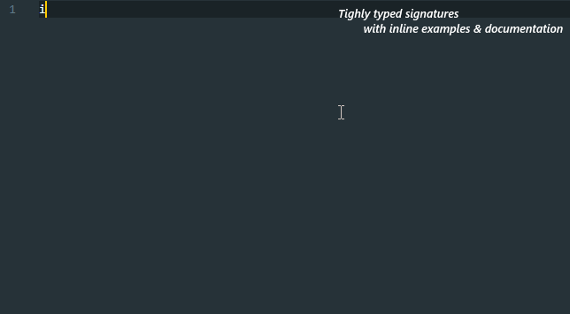

<p align="left">
  <a href="https://github.com/commonlyjs/commonly/actions">
    
  </a>
  <a href="https://coveralls.io/github/commonlyjs/commonly?branch=master">
    
  </a>
  <a href="https://codecov.io/gh/commonlyjs/commonly">
    
  </a>
  <a href="https://david-dm.org/commonlyjs/commonly" title="Dependencies Status">
    
  </a>
  <a href="https://gitter.im/commonlyjs/community?utm_source=badge&utm_medium=badge&utm_campaign=pr-badge">
    
  </a>
</p>

<br />
<br />
<br />
<p align="center">
  
  <p align="center">
    A modern utility library for JavaScript/TypeScript.
    <br />
    <a href="https://commonlyjs.com/api"><strong>Explore the API »</strong></a>
    <br />
    <br />
    <a href="https://github.com/commonlyjs/commonly/issues">Report a bug</a>
    &nbsp;&nbsp;·&nbsp;&nbsp;
    <a href="https://github.com/commonlyjs/commonly/issues">Request a feature</a>
  </p>
</p>
<br />
<br />


Table of Contents
------------------


* [Overview](#overview)
    * [Why Commonly?](#why-commonly)
    * [What's different?]()
* [Getting started](#getting-started)
    * [Installation](#installation)
    * [Examples](#examples)
* [Documentation](#documentation)
    * [Articles](#articles)
    * [API reference](#api-reference)
    * [Cookbook](#cookbook)
* [Roadmap](#roadmap)


Overview  
---------
Lorem ipsum dolor sit amet, consectetur adipiscing elit. 
Proin maximus rutrum felis, sed lobortis metus sagittis in.
In id lectus est. Phasellus interdum lacus sed mattis feugiat. 
Integer lacinia dictum magna, quis gravida risus lacinia et. 
Sed bibendum risus eu malesuada iaculis. Vivamus at ultrices nisi.
 
### Why Commonly?
Proin maximus rutrum felis, sed lobortis metus sagittis in.
In id lectus est. Phasellus interdum lacus sed mattis feugiat.
Suspendisse potenti. Donec est ex, aliquam a ultrices et, placerat sit amet lacus. 
Nam ac ultricies lacus, ac consequat lorem. Pellentesque luctus dapibus tempor.

### What's different?
Integer lacinia dictum magna, quis gravida risus lacinia et. 
Sed bibendum risus eu malesuada iaculis. Vivamus at ultrices nisi.
* Curabitur est nisl, dignissim at eros in, aliquet egestas sem. 
* Etiam ut lacinia urna. Phasellus quis scelerisque arcu, quis fermentum mauris. 
* Donec et ante orci. Nulla pretium commodo pellentesque.


Getting started  
----------------
This library comes in multiple packages, you match and choose whichever you need.  

Some of the packages may have dependencies, often only related to the problem they are solving.  
An example of such is the `@commonly/type` package, from which only TypeScript users can benefit.
Another example is a package that may require a specific environment, like a browser or a Node.js-based one.  

When a package requires such, it should state so in its manifest file, a package.json, and the documentation.

### Installation
As an example, we will install a couple of core packages.
```shell script
npm install   @commonly/function  @commonly/iterable  @commonly/math  @commonly/number  @commonly/string
```
**Users of TypeScript**, remember to install the `@commonly/type` package, it contains type definitions used in other packages.

### Examples
```typescript
// A simple example using 
```


Documentation  
--------------
To achieve this we code clean with type annotations and inline documentation, 
write human-readable unit tests in a behavior-driven development fashion and produce helpful content with examples.

### Articles
You can find articles on more advanced usage and some exciting subjects we try to tackle on [commonlyjs.com/articles/](https://commonlyjs.com/articles/).

### API reference
Every member of our API can be found here on [commonlyjs.com/api/](https://commonlyjs.com/api/).  
You can also browse `packages/<package-name>/docs/` directory if you prefer to read in a GitHub markdown format.
Both documents are synchronized, so you will never find any to be out of date.

### Cookbook
Whenever you find some functionality missing, look for it in our cookbook on [commonlyjs.com/cookbook/](https://commonlyjs.com/cookbook/).


Roadmap  
--------
### 1.x-next
* [ ] Automate the package publication process and a generation of the package's documentation.
* [ ] Update every function's JSDoc to include [Damas–Hindley–Milner type](https://en.wikipedia.org/wiki/Hindley%E2%80%93Milner_type_system) signature.
* [ ] Implement a runtime type checking for every included function based on [Algorithm W](https://en.wikipedia.org/wiki/Hindley%E2%80%93Milner_type_system#Algorithm_W).
* [ ] Provide complete set of core packages:
    * [ ] `@commonly/data`
        * [ ] `@commonly/data/MultiwayTree`
        * [ ] `@commonly/data/Matrix`
        * [ ] `@commonly/data/Stack`
        * [ ] `@commonly/data/Queue`
        * [ ] `@commonly/data/Vector`
    * [ ] `@commonly/function`
        * [ ] `@commonly/function/compose`
        * [ ] `@commonly/function/curry`
        * [ ] `@commonly/function/debounce`
        * [ ] `@commonly/function/identity`
        * [ ] `@commonly/function/memoize`
        * [ ] `@commonly/function/negate`
        * [ ] `@commonly/function/noop`
        * [ ] `@commonly/function/partial`
        * [ ] `@commonly/function/pipe`
        * [ ] `@commonly/function/reduced`
        * [ ] `@commonly/function/reducer`
        * [ ] `@commonly/function/tap`
        * [ ] `@commonly/function/throttle`
    * [ ] `@commonly/iterable`
        * [ ] `@commonly/iterable/chain`
        * [ ] `@commonly/iterable/drop`
        * [ ] `@commonly/iterable/filter`
        * [ ] `@commonly/iterable/find`
        * [ ] `@commonly/iterable/flatten`
        * [ ] `@commonly/iterable/head`
        * [ ] `@commonly/iterable/includes`
        * [ ] `@commonly/iterable/last`
        * [ ] `@commonly/iterable/map`
        * [ ] `@commonly/iterable/nth`
        * [ ] `@commonly/iterable/reduce`
        * [ ] `@commonly/iterable/slice`
        * [ ] `@commonly/iterable/tail`
        * [ ] `@commonly/iterable/take`
        * [ ] `@commonly/iterable/transduce`
    * [ ] `@commonly/logic`
        * [ ] `@commonly/logic/and`
        * [ ] `@commonly/logic/nand`
        * [ ] `@commonly/logic/not`
        * [ ] `@commonly/logic/or`
        * [ ] `@commonly/logic/xnor`
        * [ ] `@commonly/logic/xor`
    * [ ] `@commonly/math`
        * [ ] `@commonly/math/add`
        * [ ] `@commonly/math/ceil`
        * [ ] `@commonly/math/decrement`
        * [ ] `@commonly/math/divide`
        * [ ] `@commonly/math/floor`
        * [ ] `@commonly/math/increment`
        * [ ] `@commonly/math/maximum`
        * [ ] `@commonly/math/mean`
        * [ ] `@commonly/math/median`
        * [ ] `@commonly/math/minimum`
        * [ ] `@commonly/math/multiply`
        * [ ] `@commonly/math/round`
        * [ ] `@commonly/math/subtract`
    * [ ] `@commonly/number`
        * [ ] `@commonly/number/clamp`
        * [ ] `@commonly/number/random`
    * [ ] `@commonly/reflect`
        * [ ] `@commonly/reflect/isArray`
        * [ ] `@commonly/reflect/isBoolean`
        * [ ] `@commonly/reflect/isError`
        * [ ] `@commonly/reflect/isFunction`
        * [ ] `@commonly/reflect/isMap`
        * [ ] `@commonly/reflect/isNil`
        * [ ] `@commonly/reflect/isNull`
        * [ ] `@commonly/reflect/isNumber`
        * [ ] `@commonly/reflect/isObject`
        * [ ] `@commonly/reflect/isPrimitve`
        * [ ] `@commonly/reflect/isPromise`
        * [ ] `@commonly/reflect/isReduced`
        * [ ] `@commonly/reflect/isRegExp`
        * [ ] `@commonly/reflect/isSet`
        * [ ] `@commonly/reflect/isString`
        * [ ] `@commonly/reflect/isSymbol`
        * [ ] `@commonly/reflect/isUndefined`
    * [ ] `@commonly/string`
        * [ ] `@commonly/string/camelcase`
        * [ ] `@commonly/string/capitalize`
        * [ ] `@commonly/string/constantcase`
        * [ ] `@commonly/string/dashcase`
        * [ ] `@commonly/string/lowercase`
        * [ ] `@commonly/string/pascalcase`
        * [ ] `@commonly/string/snakecase`
        * [ ] `@commonly/string/traincase`
        * [ ] `@commonly/string/uppercase`
        * [ ] `@commonly/string/words`
    * [ ] `@commonly/transducer`
        * [ ] `@commonly/transducer/xchain`
        * [ ] `@commonly/transducer/xdrop`
        * [ ] `@commonly/transducer/xfilter`
        * [ ] `@commonly/transducer/xflatten`
        * [ ] `@commonly/transducer/xmap`
        * [ ] `@commonly/transducer/xslice`
        * [ ] `@commonly/transducer/xtail`
        * [ ] `@commonly/transducer/xtake`
    * [ ] `@commonly/type`
        * [ ] `@commonly/type/Identity`
        * [ ] `@commonly/type/Mapper`
        * [ ] `@commonly/type/Predicate`
        * [ ] `@commonly/type/Primitive`
        * [ ] `@commonly/type/Reduced`
        * [ ] `@commonly/type/Reducer`
        * [ ] `@commonly/type/Transducer`
* [ ] Provide complete set of auxiliary packages:
    * [ ] `@commonly/async`
    * [ ] `@commonly/dom`
    * [ ] `@commonly/fs`
